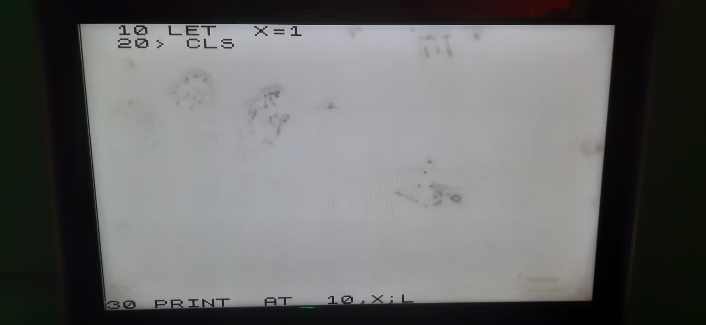
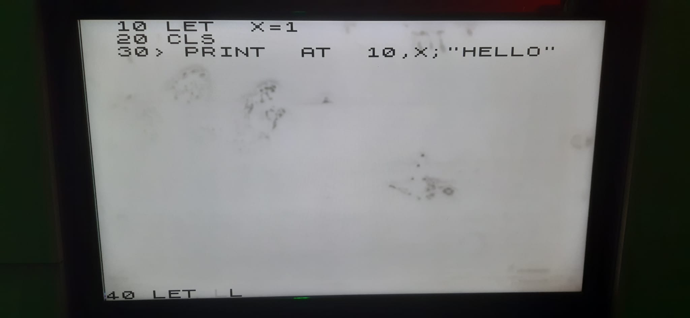
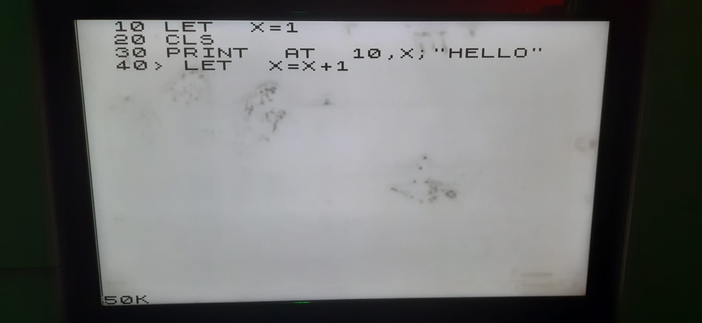
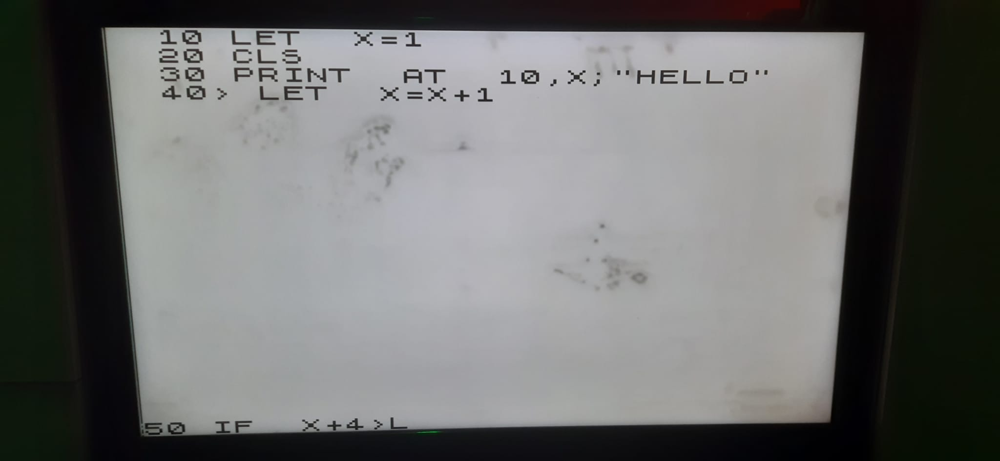
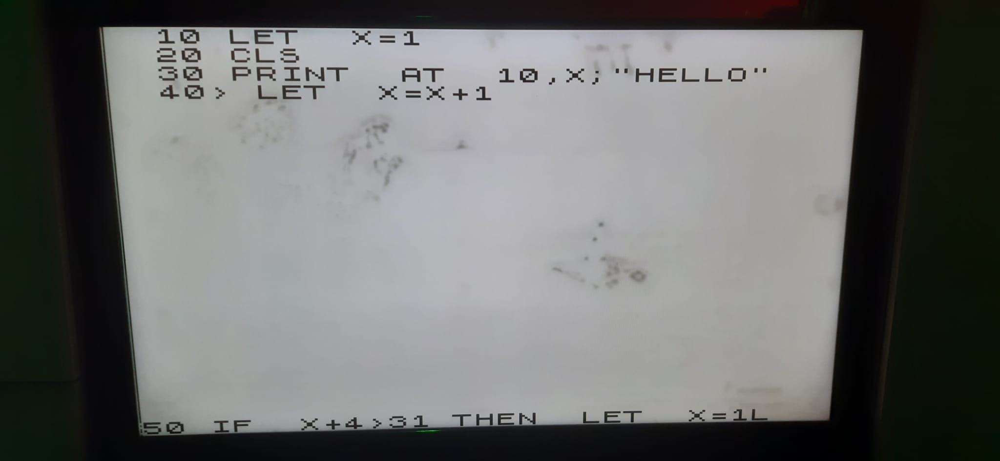
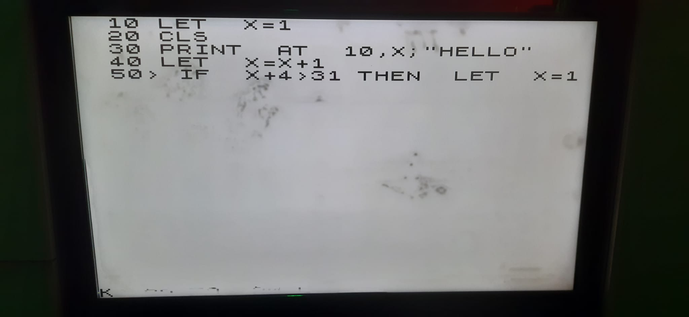
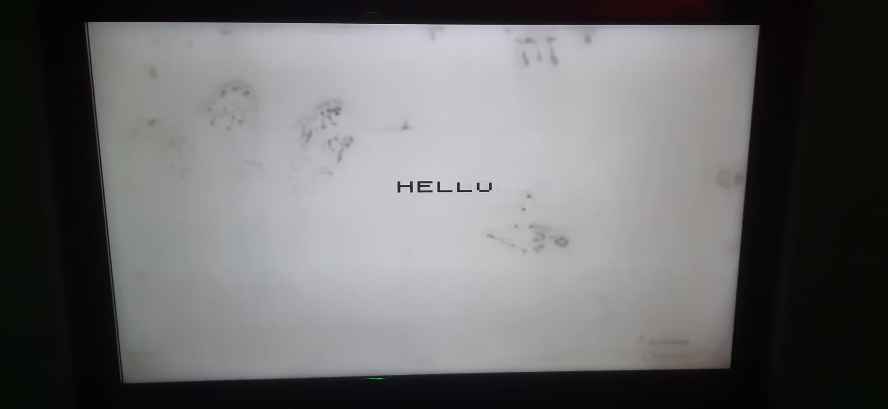

# ZX Spectrum on Tang Nano 9K FPGA
## English (EN)
### Overview

This project implements a ZX Spectrum on a Tang Nano 9K FPGA. It runs classic Spectrum BASIC programs and supports automated typing via the included my_fsm module.

### Features

Runs ZX Spectrum BASIC programs

Typist module (my_fsm) for automated program entry

HDMI output: 1024x768 @ 24Hz (4x scale), no border

Fully implemented in Verilog, except for the CPU (Z80)

Video memory using Gowin DPB RAM

Supports multiple RAM/ROM blocks

### Future Plans

Keyboard input

Tape module for saving/loading programs from SD card using original SAVE/LOAD commands

Sound via HDMI

### Usage

Program your FPGA with the provided Verilog code.

Load BASIC programs to be typed automatically by the my_fsm typist module.

The Spectrum emulator will run the programs as on the original hardware.

## Nederlands (NL)
### Overzicht

Dit project implementeert een ZX Spectrum op een Tang Nano 9K FPGA. Het kan klassieke Spectrum BASIC-programma’s draaien en ondersteunt automatisch typen via de my_fsm module.

### Functies

Draait ZX Spectrum BASIC-programma’s

Typist module (my_fsm) voor automatisch invoeren van programma’s

HDMI-uitvoer: 1024x768 @ 24Hz (4x scale), geen border

Volledig geïmplementeerd in Verilog, behalve de CPU (Z80)

Videogeheugen via Gowin DPB RAM

Ondersteunt meerdere RAM/ROM-blokken

### Toekomstplannen

Toetsenbordondersteuning

Tape-module voor opslaan/laden van programma’s vanaf SD-kaart met originele SAVE/LOAD commando’s

Geluid via HDMI

### Gebruik

Programmeer de FPGA met de meegeleverde Verilog code.

Laad BASIC-programma’s die automatisch door de my_fsm typist module worden ingetypt.

De Spectrum-emulator draait de programma’s zoals op de originele hardware.

## Magyar (HU)
### Áttekintés

Ez a projekt egy ZX Spectrumot valósít meg Tang Nano 9K FPGA-n. Klasszikus Spectrum BASIC programokat futtat, és támogatja az automatikus gépelést a my_fsm modul segítségével.

### Funkciók

Futtatja a ZX Spectrum BASIC programokat

Typist modul (my_fsm) az automatikus programbevitelhez

HDMI kimenet: 1024x768 @ 24Hz (4x scale), nincs border

Teljes egészében Verilog-ban, a CPU (Z80) kivételével

Videó memória Gowin DPB RAM-mal

Több RAM/ROM blokk támogatása

### Jövőbeli tervek

Billentyűzet támogatás

Tape modul programok mentésére/betöltésére SD kártyáról az eredeti SAVE/LOAD parancsokkal

Hang HDMI-n keresztül

### Használat

Programozd be az FPGA-t a mellékelt Verilog kóddal.

Töltsd be a BASIC programokat, amelyeket a my_fsm modul automatikusan begépel.

A Spectrum emulátor a programokat az eredeti hardverhez hasonlóan futtatja.

